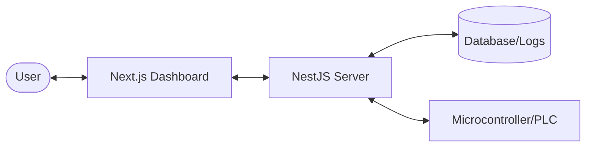

# 01 Introduction to Backend in Control Systems

Behind every sleek dashboard is a powerful service layer that handles the "heavy lifting." In this module, we introduce the concept of the Backend specifically for control systems.

### The Overview
In a control system, the Backend is much more than just a data server—it is the **System Brain**. It bridges the gap between low-level hardware (like PLCs and MCUs) and high-level user interfaces, ensuring that commands are processed safely and data is logged reliably.

### Learning Objectives
By completing this module, you will:
1. **Define the Backend Role**: Understand why a central server is needed for industrial monitoring.
2. **Visualize Architecture**: Map the relationship between Frontend, Backend, Database, and Physical Devices.
3. **Justify Tooling Choices**: Understand why **NestJS** and **TypeScript** are chosen for mission-critical applications.
4. **Identify Core Features**: Recognize the five key roles a backend plays in our monitoring stack.

---

## What is a "Backend"?
In the context of a web application, the **Backend** (or server-side) is the part of the software that remains hidden from the end-user. It handles data processing, business logic, device integration, and database interactions.

### The Role of Backend in INC343
For control and monitoring systems, the backend serves as the **Brain** and the **Bridge**:

1. **Bridge to Hardware**: The backend communicates with embedded systems, PLC, or IoT devices (using protocols like MQTT, Modbus, or HTTP).
2. **Business Logic**: It decides what to do based on data. If a temperature sensor reads > 50°C, the backend might send a command to turn on a fan.
3. **Data Persistence**: It records historical data (logging) for future analysis.
4. **Security & Authentication**: It ensures only authorized users can toggle critical controls.
5. **Real-time Distribution**: It broadcasts live sensor data to all connected clients (Next.js dashboards).

## Architecture Overview
A typical modern control system architecture looks like this:

### How it Works: The System Flow

The diagram above illustrates how information and commands propagate through a control system:

1.  **The User Interface**: The **Frontend (Next.js)** provides the visual representation. When a user clicks a button to "Turn on Heat," it doesn't talk to the heater directly; it sends a request to the Backend.
2.  **The Brain (Backend)**: The **NestJS Server** receives the request. It checks if the user has permission, validates the command, and logs the intent to the **Database**.
3.  **The Physical Bridge**: The Backend then translates that high-level command ("Turn on Heat") into a low-level signal (like an HTTP call or MQTT message) sent to the **Physical Device (Microcontroller/PLC)**.
4.  **The Feedback Loop**: Sensor data from the device follows the reverse path—sent to the Backend, saved for historical logging, and pushed instantly to the Frontend so the user sees the temperature rise in real-time.

---

## Why NestJS?
We use NestJS because it provides:
- **TypeScript First**: Full type safety out of the box.
- **Modular Structure**: Easily separate device logic from user logic.
- **Industry Standards**: Built on top of Express (or Fastify), with powerful tools for validation, security, and real-time.
- **Dependency Injection**: Promotes clean, testable code.

---
[Back to Overview](./README.md) | [Next: NestJS Architecture](./02-NestJS-Architecture.md)
