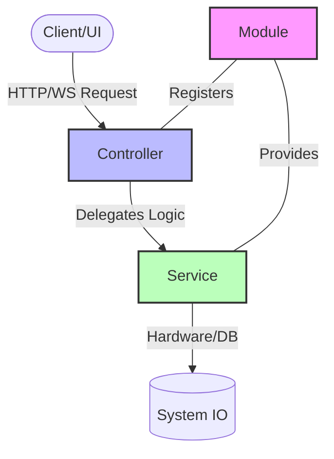

# 02 NestJS Architecture Fundamentals

In this module, we explore the core structural patterns that make NestJS a powerful choice for building complex control backends.

### The Overview
To build scalable control and monitoring systems, we need more than just code—we need a structured design pattern. NestJS provides a modular architecture that separates concerns, making it easier to maintain, test, and expand as your system grows from a single sensor to an entire factory floor.

### Learning Objectives
By completing this module, you will:
1. **Understand Modularity**: Learn how Modules encapsulate functionality into logical units.
2. **Master Routing**: See how Controllers act as the entry point for system requests.
3. **Decouple Logic**: Use Services to handle business logic and hardware communication.
4. **Learn DI Principles**: Understand how Dependency Injection connects components seamlessly.



### How it Works: The Modular Chain

The diagram above shows how NestJS organizes code to handle system I/O:

1. **The Entry Point (Controller)**: The **Controller** is the "Receiver" that waits for external signals (like an HTTP GET request). It doesn't know *how* to talk to hardware; it only knows *which* URL corresponds to which action.
2. **The Worker (Service)**: The **Service** is where the "heavy lifting" happens. It contains the logic to communicate with physical sensors, databases, or PLC registers. 
3. **The Orchestrator (Module)**: The **Module** acts as the glue. It tells the NestJS engine: "Here is the Controller for the hardware routes, and here is the Service (Provider) it needs to do its job."
4. **The System I/O**: The Service eventually reaches out to the **IO layer** (Database or Microcontroller) to effect change in the physical world.

---

NestJS is heavily inspired by Angular, focusing on a structured, modular architecture. Understanding these three pillars is essential:

## 1. Modules
A **Module** is a class annotated with a `@Module()` decorator. It encapsulates a closely related set of capabilities.

- **Objective**: Organize the application into logical blocks (e.g., `DeviceModule`, `HistoryModule`, `UserModule`).
- Every Nest app has at least one **Root Module**.

```typescript
@Module({
  imports: [],
  controllers: [DeviceController],
  providers: [DeviceService],
})
export class DeviceModule {}
```

## 2. Controllers
**Controllers** handle incoming **Requests** and return **Responses**. They are responsible for the routing mechanism.

- **Objective**: Define the API endpoints (e.g., `GET /devices`, `POST /devices/1/control`).

```typescript
@Controller('devices')
export class DeviceController {
  constructor(private readonly deviceService: DeviceService) {}

  @Get()
  getAllDevices() {
    return this.deviceService.findAll();
  }
}
```

## 3. Services (Providers)
**Services** contain the **Business Logic**. They are where the "heavy lifting" happens.

- **Objective**: Fetching data from a DB, calculating control signals, or communicating with hardware.
- Services are **Providers** that can be injected into controllers via **Dependency Injection**.

```typescript
@Injectable()
export class DeviceService {
  private devices = [{ id: 1, name: 'Main Pump', status: 'OFF' }];

  findAll() {
    return this.devices;
  }
}
```

## Dependency Injection (DI)
Instead of a controller creating its own service (`new Service()`), the NestJS runtime "injects" it. This makes the code modular and easy to mock for testing.

---
[Back to Overview](./README.md) | [Next: RESTful API Design](./03-RESTful-API-for-Devices.md)
