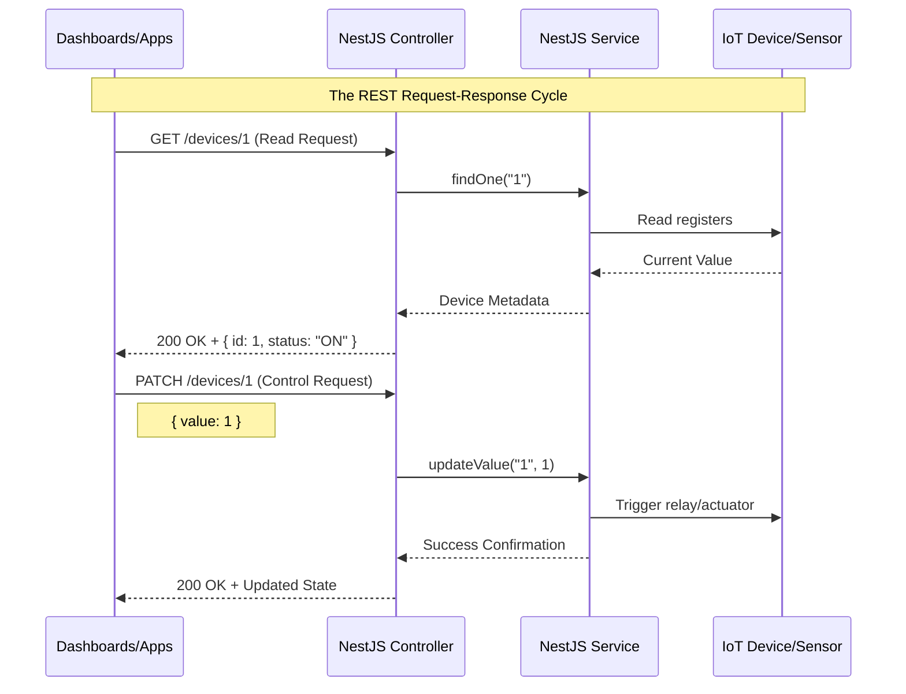

# 03 RESTful API Design for Devices

REST (Representational State Transfer) is the standard architectural style for designing networked applications. In a control system context, we use REST to model physical hardware as digital resources.

### The Overview
By treating every sensor and actuator as a "Resource," we can use standard web protocols to interact with physical hardware. This standardization allows diverse clients (mobile apps, web dashboards, third-party services) to control and monitor your system using a universal language (HTTP).

### Learning Objectives
By completing this module, you will:
1. **Model Hardware as Resources**: Learn to design intuitive URI paths for your devices.
2. **Utilize HTTP Verbs**: Understand how GET, POST, and PATCH map to physical actions.
3. **Implement Data Validation**: Use DTOs to ensure control signals are safe and well-formatted.
4. **Master NestJS Decorators**: Learn to use `@Param`, `@Body`, and method decorators to build robust endpoints.



### How it Works: The Request-Response Cycle

The diagram above tracks the journey of a single control or monitoring command through the system:

#### 1. The Monitoring Request (GET)
- **Initiation**: The user's dashboard requests the latest state of a specific device (e.g., Temperature Sensor #1).
- **Execution**: The **Controller** receives the request and asks the **Service** to fetch the data. 
- **Hardware Integration**: The Service communicates directly with the hardware (reading memory registers or pins) to get the live value.
- **Completion**: The data is bundled with metadata (ID, Name, Status) and sent back as a standard JSON response.

#### 2. The Control Command (PATCH)
- **The Intent**: The user wants to change a value (e.g., turn a relay ON). This is a "Partial Update" (PATCH).
- **Security & Validation**: The **Controller** validates that the payload (e.g., `{ "value": 1 }`) is correct before proceeding.
- **Action**: The Service sends the physical signal to the hardware's actuator.
- **Confirmation**: Once the physical action is successful, the server returns the updated state to confirm the switch has moved.

---

REST (Representational State Transfer) is the standard way to design APIs. In a control system, we map **Device Resources** to URI paths.

## 1. Resource Mapping
Think of your system components as resources.

- **Resource**: `Device`
- **Identifier**: `deviceId`

| HTTP Method | Endpoint | Action | Description |
| :--- | :--- | :--- | :--- |
| **GET** | `/devices` | List | Get status of all sensors/actuators |
| **GET** | `/devices/:id` | Read | Get detailed status of a specific device |
| **PATCH** | `/devices/:id` | Update | Change device name or configuration |
| **POST** | `/devices/:id/control` | Action | Send a command (ON/OFF, SPEED=50) |

## 2. Using DTOs (Data Transfer Objects)
A DTO defines the **Shape** of data coming into the API. We use them for **Validation**.

Example: Control Command DTO
```typescript
export class DeviceControlDto {
  command: 'ON' | 'OFF' | 'SET_VAL';
  value?: number;
}
```

## 3. NestJS Decorators for REST
NestJS uses decorators to define routes and parameters:

- `@Controller('path')`: Base path.
- `@Get()`, `@Post()`, `@Patch()`, `@Delete()`: HTTP methods.
- `@Param('id')`: Access URL parameters.
- `@Body()`: Access the request body.

```typescript
@Patch(':id')
updateDevice(@Param('id') id: string, @Body() updateDto: UpdateDeviceDto) {
  return this.deviceService.update(id, updateDto);
}
```

---
[Back to Overview](./README.md) | [Next: WebSockets for Real-time](./04-WebSockets-for-Real-time.md)
