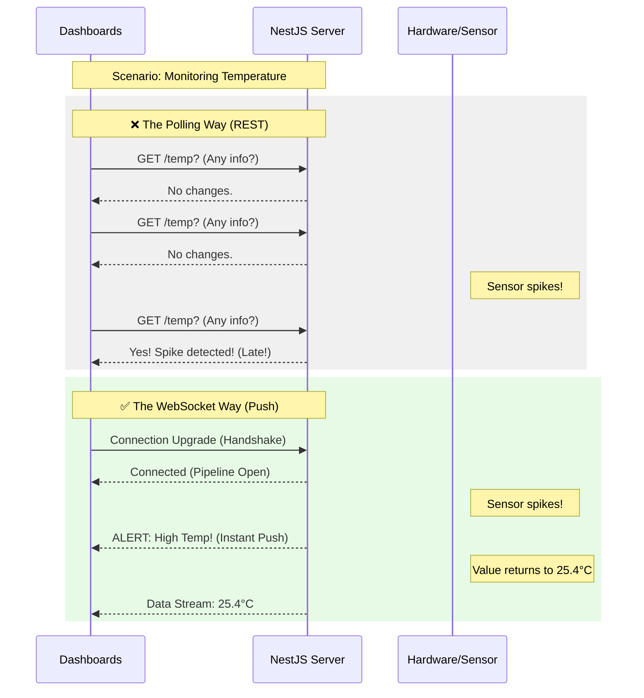

# 04 WebSockets Basics for Real-time Monitoring

Real-time monitoring requires a shift from a "Pull" architecture (where the client requests data) to a "Push" architecture (where the server broadcasts data).

### The Overview
In industrial monitoring, a delay of even a few seconds can be critical. WebSockets enable a persistent, two-way connection between the server and the browser, allowing the backend to stream sensor data and alerts to the dashboard the microsecond they occur.

### Learning Objectives
By completing this module, you will:
1. **Identify Architectural Limits**: Understand why HTTP Polling is insufficient for real-time monitoring.
2. **Understand the WebSocket Protocol**: Learn how the "Handshake" and "Persistent Connection" differ from REST.
3. **Master NestJS Gateways**: Learn to create and configure WebSocket Gateways for real-time traffic.
4. **Implement Broadcasting**: See how to "Push" data from the server to multiple connected clients simultaneously.



### How it Works: The Efficiency Gap

The diagram above illustrates the fundamental difference in how data moves through your system:

#### 1. The Polling Way (HTTP/REST)
- **Wait and See**: The client (Dashboard) must "ask" the server for updates at a fixed interval (e.g., every second).
- **Wasted Resources**: If the sensor value hasn't changed, the server still has to process the request and send a "No changes" response, wasting bandwidth and CPU.
- **The "Latency Gap"**: If a critical event (like an alarm) occurs right *after* a poll, the system won't know about it until the *next* poll occurs, causing potentially dangerous delays.

#### 2. The WebSocket Way (Push)
- **The Handshake**: The connection starts as HTTP but "upgrades" to a dedicated WebSocket pipeline that stays open.
- **Instant Reaction**: Because the "pipe" is already open, the server can "Push" a message to the client the exact millisecond the hardware detects a change. 
- **Efficiency**: No data is sent unless there is an actual update, significantly reducing network traffic while providing true real-time performance.

---

HTTP (REST) is excellent for **Command and Control**, but it is inefficient for **Continuous Monitoring**.

## The Problem with HTTP Polling
If a frontend needs to update a temperature gauge every 500ms:
- **Polling**: Frontend sends a GET request every 500ms.
- **Problem**: High overhead, delayed updates, wasted bandwidth.

## The WebSocket Solution
WebSockets provide a **Bi-directional, Persistent** connection.

1. **Handshake**: The client starts with HTTP and upgrades to WebSocket.
2. **Open Pipeline**: The server can "Push" data to the client whenever a sensor value changes.

### NestJS Gateways
In NestJS, we handle WebSockets using **Gateways**.

```typescript
@WebSocketGateway({ cors: true })
export class MonitoringGateway {
  @WebSocketServer()
  server: Server;

  // Method to push data to all connected clients
  broadcastSensorData(data: any) {
    this.server.emit('sensor-update', data);
  }
}
```

## When to use which?
- **use REST** for: Toggling a switch, changing settings, fetching historical logs.
- **use WebSockets** for: Live graphs, real-time status indicators, alarm notifications.

---
[Back to Overview](./README.md) | [Begin Workshop: Setup](./Workshop-01-NestJS-Setup.md)
