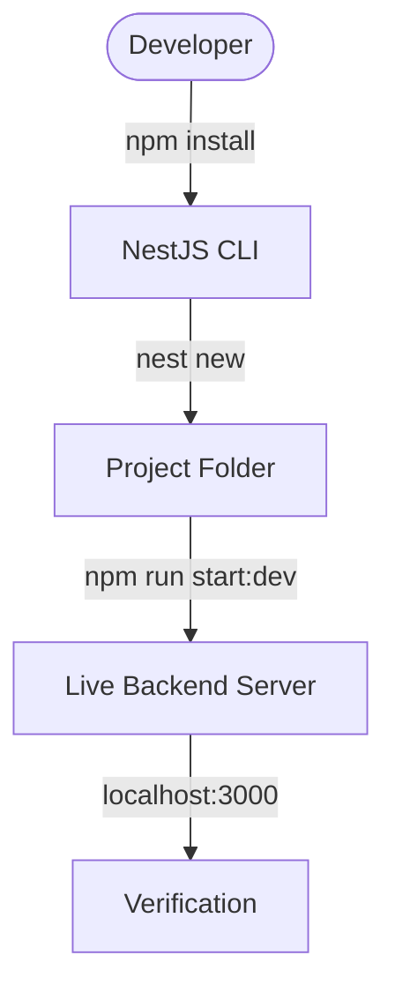
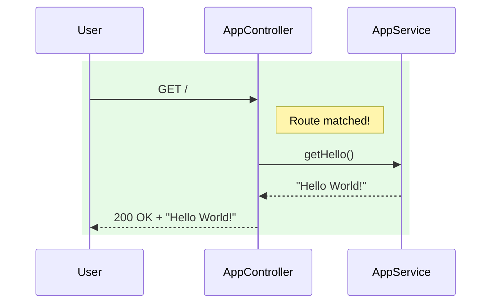
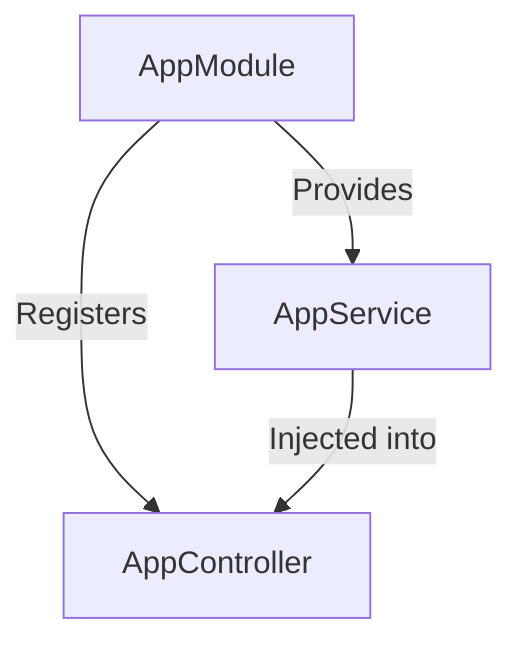

# Workshop 1: Setting up NestJS

In this workshop, you will lay the foundation for your control system's backend by setting up the **NestJS Environment**.

### The Overview
Before building complex device logic, we need a robust industrial-grade toolchain. NestJS provides a CLI (Command Line Interface) that scaffolds projects according to industry best practices, ensuring your system is modular and scalable from day one.

### Learning Objectives
By completing this workshop, you will:
1. **Toolchain Setup**: Install and verify the NestJS CLI.
2. **Project Scaffolding**: Create a new NestJS project specifically targeted for our backend services.
3. **Architecture Awareness**: Learn the roles of the core boilerplate files.
4. **Environment Verification**: Successfully run the development server and install monitoring-specific validation packages.



### How it Works: The Setup Pipeline

1.  **Preparation**: The developer installs the **CLI (Command Line Interface)** globally to gain access to NestJS automation tools.
2.  **Scaffolding**: The `nest new` command generates a standardized **Project Folder** with all necessary configuration files (TypeScript, ESLint, Git).
3.  **Bootstrapping**: Running `start:dev` compiles the code and launches the **Live Backend Server** in "watch mode."
4.  **Verification**: The developer uses a browser to verify that the server is successfully listening on port 3000.

---

## Prerequisites
- Node.js (v18+) installed.
- VS Code installed.

## Step 1: Install NestJS CLI
Open your terminal and run:
```bash
npm install -g @nestjs/cli
```

## Step 2: Create a New Project
We will name our backend `inc343-backend` and store it in a **projects** folder. Run the following commands:
```bash
# Create and enter the projects directory
mkdir projects
cd projects

# Scaffold the new NestJS project
nest new inc343-backend
```

## Step 3: Explore the Project Structure
Open the folder in VS Code. Locate the following files in `src/`:
- `main.ts`: The entry point.
- `app.module.ts`: The root module.
- `app.controller.ts`: Basic controller.
- `app.service.ts`: Basic service.

## Step 4: Run the Application
Start the development server (run this from your `Week06` folder):
```bash
cd projects/inc343-backend
npm run start:dev
```
Open your browser to [http://localhost:3000](http://localhost:3000). You should see **"Hello World!"**.

## Step 5: Install Useful Packages
Since we are building a monitoring system, we will need validation tools:
```bash
npm install class-validator class-transformer
```

---

## How NestJS Works: Under the Hood

When you generate a project, NestJS creates a structured flow for your application. Here is how the core files handle a request.

### 1. The Core Files
- **`main.ts`**: The entry point. It bootstraps the application by creating a Nest instance and telling it which module to start with (usually `AppModule`).
- **`app.module.ts`**: The root module. It acts as the "orchestrator," bringing together controllers and providers (services).
- **`app.controller.ts`**: The "receptionist." It listens for specific HTTP requests (e.g., `GET /`) and decides which code should handle them.
- **`app.service.ts`**: The "worker." It contains the actual logic (e.g., returning the string "Hello World!").

### 2. The Request Flow
When a user visits `http://localhost:3000`, the following sequence occurs:



**Step-by-Step Request Flow:**
1. **Incoming Request**: The **User** (e.g., your browser) sends an HTTP `GET` request to the root path (`/`).
2. **Routing**: NestJS checks the **AppController**. Because of the `@Get()` decorator, it confirms a "Route matched!".
3. **Delegation**: The Controller (receptionist) calls the `getHello()` method in the **AppService** (worker).
4. **Logic Execution**: The Service performs the logic and returns the resulting data (in this case, the string `"Hello World!"`).
5. **HTTP Response**: The Controller receives the data and sends it back to the **User** with a successful status code (200 OK).

### 3. Dependency Injection
NestJS uses a powerful system called **Dependency Injection**. Instead of the `AppController` creating a new instance of `AppService` manually, the `AppModule` "injects" the service into the controller.



**Key Concepts in this Diagram:**
- **AppModule (The Container)**: Acts as the central orchestrator. It holds the registry of all components.
- **Provides**: Tells NestJS that `AppService` is available for use (a "Provider").
- **Registers**: Tells NestJS that `AppController` is responsible for handling specific URLs.
- **Injected into**: This is the core of DI. Instead of the controller creating the service (`new AppService()`), **NestJS creates the service first** and pass it into the controller's constructor. This makes the code modular and much easier to test.


---
[Next: Workshop 2 - Creating a Device API](./Workshop-02-Device-API.md)
