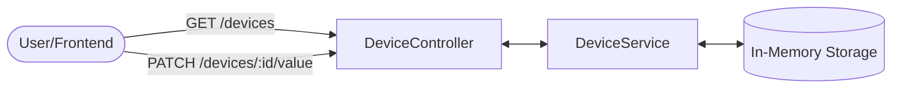

# Workshop 2: Creating a Device API

In this workshop, we will transition from basic setup to building functional **Device Management Logic**. 

### The Scenario
Imagine you are building a monitoring system for a small lab. You have several "Virtual Devices":
- **Sensors**: Providing data like Temperature or Humidity.
- **Actuators**: Devices you can control, such as a Cooling Fan or a Light Switch.

### Learning Objectives
By completing this workshop, you will:
1. **Model Data**: Define what a "Device" looks like in TypeScript.
2. **Encapsulate Logic**: Use a **Service** to manage the state of your devices in memory.
3. **Expose REST Endpoints**: Create a **Controller** that allows external users (or your frontend) to view and control these devices.
4. **Follow Best Practices**: Use the NestJS CLI to maintain a clean and scalable project structure.



### How it Works: The Device Pipeline

1.  **Request**: A **User** (via Postman) or a **Frontend Dashboard** sends an HTTP request to a specific URL.
2.  **Routing**: The **Controller** matches the URL (e.g., `GET /devices`) and triggers the corresponding method.
3.  **Logic**: The Controller delegates the task to the **Service**, which manages the data.
4.  **Persistence**: For this workshop, the Service interacts with an **In-Memory Storage** (a simple array) to retrieve or update device values.

---

## Step 1: Generate the Module, Controller, and Service
NestJS CLI can automate this for you. **Ensure you are inside the `projects/inc343-backend` directory** and run these commands:
```bash
nest generate module devices
nest generate controller devices
nest generate service devices
```

## Step 2: Define a Device Interface
Create a file `src/devices/device.interface.ts`:
```typescript
export interface Device {
  id: string;
  name: string;
  type: 'sensor' | 'actuator';
  value: number;
  status: 'ONLINE' | 'OFFLINE';
}
```

## Step 3: Implement the Service
Update `src/devices/devices.service.ts` to manage an in-memory list with proper error handling:
```typescript
import { Injectable, NotFoundException } from '@nestjs/common';
import { Device } from './device.interface';

@Injectable()
export class DevicesService {
    private devices: Device[] = [
        { id: '1', name: 'Light Bulb', type: 'actuator', value: 0, status: 'ONLINE' },
        { id: '2', name: 'Temperature Sensor', type: 'sensor', value: 25, status: 'ONLINE' },
        { id: '3', name: 'Smart Fan', type: 'actuator', value: 50, status: 'OFFLINE' },
    ];

    findAll(): Device[] {
        return this.devices;
    }

    updateValue(id: string, value: number): Device {
        const device = this.devices.find(d => d.id === id);
        if (!device) {
            throw new NotFoundException(`Device with ID ${id} not found`);
        }
        device.value = value;
        return device;
    }
}
```

## Step 4: Implement the Controller
Update `src/devices/devices.controller.ts`:
```typescript
import { Controller, Get, Patch, Param, Body } from '@nestjs/common';
import { DevicesService } from './devices.service';

@Controller('devices')
export class DevicesController {
    constructor(private readonly deviceService: DevicesService) { }

    @Get()
    getAll() {
        return this.deviceService.findAll();
    }

    @Patch(':id/value')
    update(@Param('id') id: string, @Body('value') value: number) {
        return this.deviceService.updateValue(id, value);
    }
}
```

## Step 5: Test the API
Use **Postman** or **Thunder Client** (VS Code extension):
- **GET** `http://localhost:3000/devices`
- **PATCH** `http://localhost:3000/devices/1/value` with JSON body `{"value": 30.2}`

### Sample Results

**Result of `GET /devices`**:
```json
[
    {
        "id": "1",
        "name": "Light Bulb",
        "type": "actuator",
        "status": "ONLINE"
    },
    {
        "id": "2",
        "name": "Temperature Sensor",
        "type": "sensor",
        "value": 25,
        "status": "ONLINE"
    },
    {
        "id": "3",
        "name": "Smart Fan",
        "type": "actuator",
        "value": 50,
        "status": "OFFLINE"
    }
]
```

**Result of `PATCH /devices/1/value`**:
```json
{
    "id": "1",
    "name": "Light Bulb",
    "type": "actuator",
    "status": "ONLINE"
}
```

---


---

## Appendix: Understanding HTTP Methods

In REST APIs, we use different HTTP "verbs" to tell the server what action to perform. Here is a breakdown of the most common methods:

| Method | Purpose | Idempotent? | Description |
| :--- | :--- | :--- | :--- |
| **GET** | Read | Yes | Retrieves data from the server. Should not change any state. |
| **POST** | Create | No | Submits data to create a *new* resource. |
| **PUT** | Replace | Yes | Updates a resource by *replacing* it entirely with new data. |
| **PATCH** | Update | No | Performs a *partial* update (e.g., just changing the `value` of a device). |
| **DELETE** | Remove | Yes | Deletes a specific resource from the server. |
| **HEAD** | Metadata | Yes | Identical to GET, but the server returns only the headers (no body). |
| **OPTIONS** | Discovery | Yes | Asks the server which HTTP methods are supported (common in CORS). |

> **What is Idempotency?** An operation is **idempotent** if performing it multiple times has the same result as performing it once. For example, deleting a specific ID twice results in that ID being gone both times (the state of the server is the same after the 1st and 100th call).

---
[Next: Workshop 3 - Real-time Notifications](./Workshop-03-WS-Notification.md)
