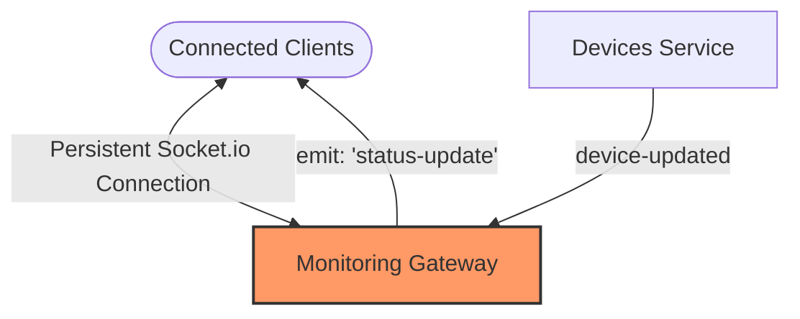
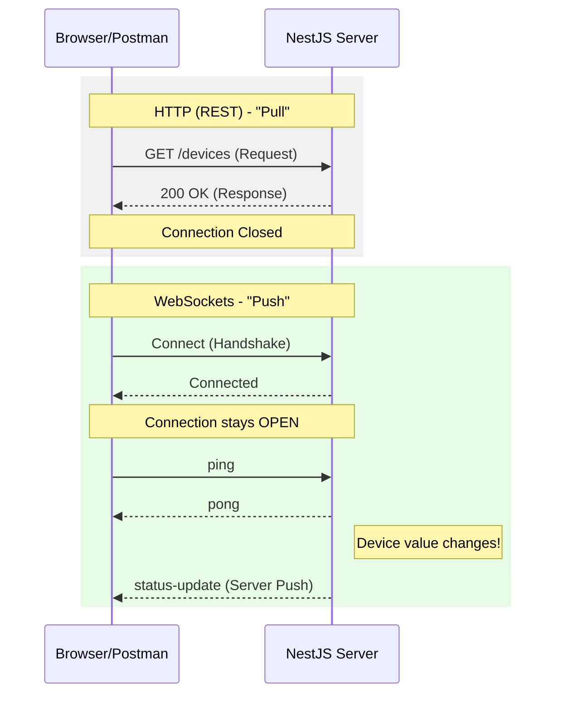

# Workshop 3: Real-time Communication with WebSockets

In this workshop, we will transition from a "Pull" architecture (REST) to a **"Push" architecture** using WebSockets. Instead of the user constantly refreshing for updates, the server will "push" data to all connected clients the moment a sensor value changes.

### The Overview
In industrial monitoring, milliseconds matter. If a temperature sensor hits a critical threshold, you cannot wait for the next periodic refresh. **WebSockets** provide a persistent, two-way connection between the browser and the server, allowing for instantaneous notifications.

### Learning Objectives
By completing this workshop, you will:
1. **Infrastructure Setup**: Install the necessary NestJS WebSocket and Socket.io modules.
2. **Implement a Gateway**: Create a WebSocket Gateway to manage real-time connections.
3. **Event Broadcasting**: Learn how to "emit" data from the server to all connected clients.
4. **Service Integration**: Inject your Gateway into existing services to trigger updates based on business logic.



### How it Works: The Notification Pipeline

1.  **Observation**: The **User** (via Postman) maintains a persistent **Socket.io Connection** with the server.
2.  **Event Trigger**: When a device value is updated in the **Service**, it doesn't just return a response; it notifies the **Gateway**.
3.  **Broadcast**: The Gateway "emits" (pushes) a `status-update` signal to all **Connected Clients**.
4.  **Real-time Update**: The client receives the data instantly, without ever having to click "Refresh."

---

## Step 1: Install WebSocket Dependencies
NestJS uses standard WebSocket libraries but wraps them in a powerful decorator-based system. Run this in your `inc343-backend` directory:

```bash
npm install @nestjs/websockets @nestjs/platform-socket.io
```

## Step 2: Generate a Gateway
A **Gateway** in NestJS is the WebSocket equivalent of a **Controller**. It handles incoming messages and manages connections.

```bash
nest generate gateway monitoring
```

## Step 3: Implement the Gateway
Update `src/monitoring/monitoring.gateway.ts`. We will configure it to allow "CORS" (so browsers can connect) and add a method to broadcast updates.

```typescript
import { WebSocketGateway, WebSocketServer, SubscribeMessage, MessageBody } from '@nestjs/websockets';
import { Server } from 'socket.io';

@WebSocketGateway({ 
  cors: { origin: '*' } // Allow any client to connect
})
export class MonitoringGateway {
  @WebSocketServer()
  server: Server;

  // Manual method to broadcast data to all clients
  sendUpdate(payload: any) {
    this.server.emit('status-update', payload);
  }

  // Handle a test message from the client
  @SubscribeMessage('ping')
  handlePing(@MessageBody() data: string): string {
    return 'pong';
  }
}
```

## Step 4: Integrate Gateway with Devices Service
Now, we want to trigger a WebSocket message every time `updateValue` is called in our `DevicesService`.

1. **Create `src/monitoring/monitoring.module.ts`**: This ensures our Gateway is a "Singleton" (only one instance exists in the whole app).
```typescript
import { Module } from '@nestjs/common';
import { MonitoringGateway } from './monitoring.gateway';

@Module({
  providers: [MonitoringGateway],
  exports: [MonitoringGateway],
})
export class MonitoringModule {}
```

2. **Update `src/devices/devices.module.ts`**: Import the `MonitoringModule`.
```typescript
import { Module } from '@nestjs/common';
import { DevicesController } from './devices.controller';
import { DevicesService } from './devices.service';
import { MonitoringModule } from '../monitoring/monitoring.module';

@Module({
  imports: [MonitoringModule], // Import the module here
  controllers: [DevicesController],
  providers: [DevicesService],
})
export class DevicesModule {}
```

3. **Update `src/devices/devices.service.ts`**: Inject the shared gateway.
```typescript
import { Injectable, NotFoundException } from '@nestjs/common';
import { Device } from './device.interface';
import { MonitoringGateway } from '../monitoring/monitoring.gateway';

@Injectable()
export class DevicesService {
    constructor(private readonly gateway: MonitoringGateway) { }

    private devices: Device[] = [
        { id: '1', name: 'Light Bulb', type: 'actuator', value: 0, status: 'ONLINE' },
        { id: '2', name: 'Temperature Sensor', type: 'sensor', value: 25, status: 'ONLINE' },
        { id: '3', name: 'Smart Fan', type: 'actuator', value: 50, status: 'OFFLINE' },
    ];

    findAll(): Device[] {
        return this.devices;
    }

    updateValue(id: string, value: number): Device {
        const device = this.devices.find(d => d.id === id);
        if (!device) throw new NotFoundException('Device not found');

        device.value = value;

        // PUSH EVENT TO WEBSOCKETS (This now uses the correct shared instance!)
        this.gateway.sendUpdate(device);

        return device;
    }
}
```

## Step 5: Verify Real-time Updates

Testing WebSockets requires a client that supports the **Socket.io** protocol. We will use Postman.

### 1. Configure the Postman Socket.IO Request
1.  Click the **New** button in the top-left corner of Postman.
2.  Select **Socket.IO** (look for the orange lightning bolt icon).
3.  Enter the URL: `ws://localhost:3000`
4.  Click the blue **Connect** button. You should see a green "Connected" status.

### 2. Set up Event Listeners
Connecting isn't enough; you must tell Postman which "events" to watch for:
1.  Go to the **Events** tab (middle of the screen).
2.  In the **Listeners** field, type `status-update` and click **Add**. 
    > **Note**: This name must exactly match the string used in your `monitoring.gateway.ts` (`this.server.emit('status-update', ...)`). It is not a reserved word; it is a custom "channel" name defined in your code.
3.  Switch to the **Message** tab. This is where your data will appear.

### 3. Verification Test (The "Ping" Test)
Before testing the devices, verify that your server is responding:
1.  In the **Message** tab, look for the text box just to the left of the blue **Send** button (it says "Event name").
2.  Type `ping` into that box.
3.  Click **Send**.
4.  Look at the **Response** log at the bottom. You should see a green entry showing the server sent back `pong`.
    > **Note on (empty)**: You might see `ping (empty)` in the log. This is normal! `ping` is the **Event Name** (the signal/channel) and `(empty)` just means you didn't send any extra data (Payload) with that signal.

### 4. Trigger a Real Device Update
1.  Keep the WebSocket tab **Connected**.
2.  Open a **New Tab** in Postman (a normal HTTP request).
3.  Set the request method to **PATCH** and enter the URL: `http://localhost:3000/devices/1/value`.
4.  **Define the JSON Body**:
    *   Click the **Body** tab (below the URL bar).
    *   Select the **raw** radio button.
    *   In the dropdown menu on the right, change **Text** to **JSON**.
    *   Paste the following into the editor:
        ```json
        { "value": 85.5 }
        ```
5.  Click the blue **Send** button.
6.  Switch back to the WebSocket tab. You will see a new `status-update` event containing the full Device JSON!

### Sample WebSocket Packet
When you update a device, all clients will receive:
```json
{
  "id": "1",
  "name": "Light Bulb",
  "type": "actuator",
  "value": 30.2,
  "status": "ONLINE"
}
```

---

## Appendix: HTTP vs. WebSockets



| Feature | HTTP (REST) | WebSockets (Gateways) |
| :--- | :--- | :--- |
| **Connection** | Temporary (Request/Response) | Persistent (Always Open) |
| **Communication** | Uni-directional (Client asks) | Bi-directional (Server can initiate) |
| **Overhead** | High (Headers sent every time) | Low (Lightweight frames) |
| **Best For** | Fetching data once, Login, etc. | Real-time charts, Notifications, Chat. |

---
[Congratulations! You have completed the Backend Foundation for Week 06.](./README.md)
